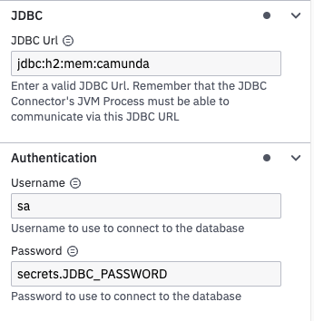
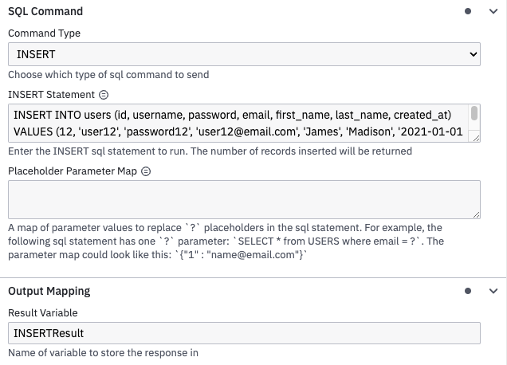

[](https://github.com/camunda-community-hub/community)
[](https://github.com/Camunda-Community-Hub/community/blob/main/extension-lifecycle.md#proof-of-concept-)


# Camunda 8 JDBC Connector

!!! This is a very new project and still a work in progress, please use at your own risk !!!

A Camunda 8 Connector capable of connecting to Databases via JDBC and running SQL commands.

# How to Use the JDBC Connector

## Configure Desktop Modeler

To use this Connector with Desktop Modeler, download the [jdbc-connector.json element template file](element-templates/jdbc-connector.json) and [follow these steps](https://docs.camunda.io/docs/components/modeler/desktop-modeler/element-templates/configuring-templates/) to add it to your local Desktop Modeler.

After you have configured the element template, restart Desktop Modeler and try adding a new Service Task. Select the Service Task to open the Properties Panel and click the blue `Select` button under the `Template` section. Choose the `JDBC Connector` Template. 


## Configure JDBC

The JDBC url must point to a valid Database Server. In this example, we are connecting to an in memory H2 Database. 

In this example, we are using the same JDBC url (`jdbc:h2:mem:camunda`), and same username (`sa`) and password (`password`) for Multiple JDBC Connector Tasks. Under the hood, the connector will reuse connections from a single connection pool for all of these tasks.



It's also possible to configure each JDBC Connector to connect to a different database (or use a different username and password). In this case, a separate connection pool will be created for each different jdbc configuration. 

## Query for single result

Choose the `SELECT and return single record` option under the `SQL Command` properties panel. The following is an example of selecting a single record from a `USERS` table. 


Here's the result: 


## Query for List of results

Choose the `SELECT and return list of records` option under the `SQL Command` properties panel. The following is an example of querying for a list of records from a `USERS` table.


Here's the result: 


## Query and return a Map

Choose the `SELECT and return Map` option under the `SQL Command` properties panel. 

Instead of returning results as a List, this option returns them as a Map. The trick here is to define which column to use as the Map Key. In this example, we define the `Map Key Column Name` as `EMAIL`. This way, the results are indexed using the value from the `USERS.EMAIL` column. 


Here's the result, notice that the results of the query are indexed by email: 


## INSERT / UPDATE / DELETE

Choose either `INSERT`, `UPDATE`, or `DELETE` option under the `SQL Command` properties panel. The following is an example of inserting a record into the `USERS` table.



Here's the result: 


`UPDATE`, and `DELETE` work the same as `INSERT`

# Technical Overview

This connector maintains a simple in-memory cache of [DatabaseManagers](src/main/java/io/camunda/connector/db/DatabaseManager.java). One `DatabaseManager` is created for each unique jdbc  configuration. 

Each time a process instance arrives at a JDBC Connector Task, the [JdbcConnectorFunction](src/main/java/io/camunda/connector/JdbcConnectorFunction.java) checks the in-memory cache for a matching `DatabaseManager` and if one is found it is used. Otherwise, a new `DatabaseManager` is created using the jdbc configuration passed via the [JdbcConnectorRequest](src/main/java/io/camunda/connector/JdbcConnectorRequest.java) as defined in the bpmn process diagram. 

If a bpmn process diagram has multiple JDBC Connector Tasks that all share same jdbc configuration, a single [DatabaseManager](src/main/java/io/camunda/connector/db/DatabaseManager.java) is created and reused.

If a process has multiple JDBC Connector Tasks, and each Task connects to a different database or uses different database credentials, then a separate [DatabaseManager](src/main/java/io/camunda/connector/db/DatabaseManager.java) is created for each configuration.

## Supported Database Types

As of now, this project supports the following database drivers.

- [H2](src/main/java/io/camunda/connector/db/H2Database.java)
- [Postgresql](src/main/java/io/camunda/connector/db/PostgresDatabase.java)

In order for this project to support another type of database, all that is needed is to add a dependency to the [pom.xml](pom.xml) (in theory, at least!)

# TODO / Next steps

- Implement prepared statements by passing json map structure as params
- real world test against postgresql
- Generate custom svg image for this connector and update the template-connector.json
- Configure password as a SECRET
- Implement options for connection pooling?
- Create separate element templates for each type of db?
- will also need separate JDBCParam classes for each type of db?

## Build

You can package the Connector by running the following command:

```bash
mvn clean package
```

This will create the following artifacts:

- A thin JAR without dependencies.
- An uber JAR containing all dependencies, potentially shaded to avoid classpath conflicts. This will not include the SDK artifacts since those are in scope `provided` and will be brought along by the respective Connector Runtime executing the Connector.

### Shading dependencies

You can use the `maven-shade-plugin` defined in the [Maven configuration](./pom.xml) to relocate common dependencies
that are used in other Connectors and the [Connector Runtime](https://github.com/camunda-community-hub/spring-zeebe/tree/master/connector-runtime#building-connector-runtime-bundles).
This helps avoiding classpath conflicts when the Connector is executed. 

Use the `relocations` configuration in the Maven Shade plugin to define the dependencies that should be shaded.
The [Maven Shade documentation](https://maven.apache.org/plugins/maven-shade-plugin/examples/class-relocation.html) 
provides more details on relocations.

## API

### Input

```json
{
  "token": ".....",
  "message": "....."
}
```

### Output

```json
{
  "result": {
    "myProperty": "....."
  }
}
```

### Error codes

| Code | Description |
| - | - |
| FAIL | Message starts with 'fail' (ignoring case) |

## Test locally

Run unit tests

```bash
mvn clean verify
```

### Test with local runtime

Use the [Camunda Connector Runtime](https://github.com/camunda-community-hub/spring-zeebe/tree/master/connector-runtime#building-connector-runtime-bundles) to run your function as a local Java application.

In your IDE you can also simply navigate to the `LocalContainerRuntime` class in test scope and run it via your IDE.
If necessary, you can adjust `application.properties` in test scope.

### H2 Console

The `LocalContainerRuntime` spring boot application is configured to create a H2 Database Schema and insert some records. 

The H2 console can be accessed here: [http://localhost:9898/h2-console](http://localhost:9898/h2-console)

## Element Template

The element templates can be found in the [element-templates/template-connector.json](element-templates/jdbc-connector.json) file.
