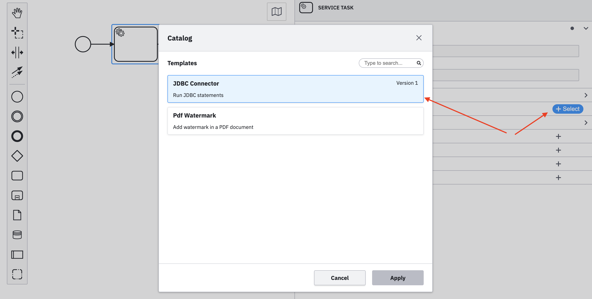
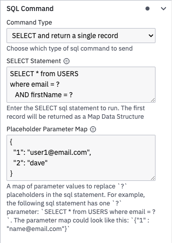
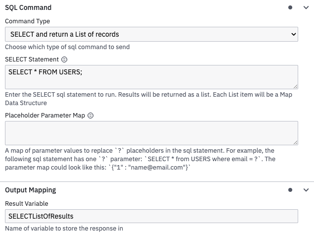

[](https://github.com/camunda-community-hub/community)
[](https://github.com/Camunda-Community-Hub/community/blob/main/extension-lifecycle.md#proof-of-concept-)


# Camunda 8 JDBC Connector

A Camunda 8 Connector capable of connecting to Databases via JDBC and running SQL commands.

In theory, this connector can use [any type](#other-database-types) of jdbc driver. So far, it's been tested against
the following types of databases (and the drivers for these types of databases are included by default):

- [H2](#h2)
- [MySql](#mysql)
- [Postgres](#postgres)

# Configure Desktop Modeler

Download the element template ([jdbc-connector.json](element-templates/jdbc-connector.json)) and [follow these steps](https://docs.camunda.io/docs/components/modeler/desktop-modeler/element-templates/configuring-templates/) to use it with your local Desktop Modeler.

After you've configured the element template, restart Desktop Modeler and try adding a new Service Task. Click the blue `Select` button under the `Template` section in the properties panel and then choose the `JDBC Connector` Template.



# JDBC Url and Connection Pooling

The JDBC url must point to a valid database server.

This connector uses the [HikariCP library](https://github.com/brettwooldridge/HikariCP) for connection pooling. A separate Connection Pool will be created for each unique combination of `Jdbc Url` + `Username` + `Password`.

The `Password` field supports [Connector Secrets](https://docs.camunda.io/docs/components/connectors/custom-built-connectors/connector-sdk/#secrets).


When multiple JDBC Connector tasks that connect to the same database are added to the same process diagram, jdbc connections are pooled. For example, when Tasks with the same `Jdbc Url` + `Username` + `Password` combo exist, the same connection pool will be reused. A separate jdbc pool is created for each unique combination of `Jdbc Url` + `Username` + `Password`.

# Placeholders in sql

If useful, `?` placeholders can be used inside sql statements. For example:

```sql
SELECT * from USERS where email = ? and firstName = ?
```

This statement contains two `?` placeholders. This means that we need to provide a `Placeholder parameter Map` with 2 entries. For example:

```json
{
  "1": "user1@email.com",
  "2": "dave"
}
```

Here's what it would look like in Modeler:



Note that it's possible to use FEEL expressions within the Placeholder Map :muscle:

# Query for single result

Choose the `SELECT and return single record` option under the `SQL Command` properties panel.

The following is an example of selecting a single record from a `USERS` table.


The result is a single Map Data Structure:


## Query for List of results

Choose the `SELECT and return list of records` option under the `SQL Command` properties panel. The following is an example of querying for a list of records from a `USERS` table.



The result is a list of Map Objects:


## Query and return a Map

Choose the `SELECT and return Map` option under the `SQL Command` properties panel.

Instead of returning results as a List, this option returns them as a Map. The trick here is to define which column to use as the Map Key. In this example, we define the `Map Key Column Name` as `EMAIL`. This way, the results are indexed using the value from the `USERS.EMAIL` column.

> [!WARNING] The case of the `Map Key Column Name` must match exactly with the case of the column name found in the query results. For example, in H2 databases, column names in results are uppercase. However, other databases might return column names as lowercase.


Here's the result, notice that the results of the query are indexed by email:


## INSERT / UPDATE / DELETE

Choose either `INSERT`, `UPDATE`, or `DELETE` option under the `SQL Command` properties panel. The following is an example of inserting a record into the `USERS` table.


Here's the result:


`UPDATE`, and `DELETE` work the same as `INSERT`

# H2

This has been tested against H2. In fact the [unit tests](src/test/java/io/camunda/connector) use an in memory H2 database to run tests.

## H2 Console

The [LocalConnectorRuntime](src/test/java/io/camunda/connector/LocalConnectorRuntime.java) spring boot application can be used to test the connector. Each time it starts, it will create a H2 Database Schema and insert some records. It is also configured to host a H2 console here: [http://localhost:9898/h2-console](http://localhost:9898/h2-console)

# Postgres

The [docker-compose.yaml](docker-compose.yaml) contains a `postgres` service which is useful for testing this connector against Postgresql.

Run the following to start postgres listening on 5432 and accessible using username `postgres` and password `camunda`:

```shell
docker compose -f docker-compose.yaml up -d
```

Then try experimenting with [this](src/test/resources/SamplePostgresJdbcProcess.bpmn) sample bpmn process

# MySql

The [docker-compose.yaml](docker-compose.yaml) contains a `mysql` service which is useful for testing this connector against MySql.

Run the following to start MySql listening on 3306 and accessible using username `camunda` and password `camunda`:

```shell
docker compose -f docker-compose.yaml up
```

Then try experimenting with [this](src/test/resources/SampleMySqlJdbcProcess.bpmn) sample bpmn process

# Other Database Types

If you would like to use this connector to connect to a Database Type that isn't mentioned in this README, here are two options:

1. When you deploy and/or run the connector, place the appropriate jdbc driver on the classpath.
2. Clone this repository and add your driver as a dependency in the [pom.xml](pom.xml) file. Then use maven to [build](#build), and [test](#test-with-local-runtime).

# Build

You can package the Connector by running the following command:

```bash
mvn clean package
```

This will create the following artifacts:

- A thin JAR without dependencies.
- An uber JAR containing all dependencies, potentially shaded to avoid classpath conflicts. This will not include the SDK artifacts since those are in scope `provided` and will be brought along by the respective Connector Runtime executing the Connector.

## Shading dependencies

You can use the `maven-shade-plugin` defined in the [Maven configuration](./pom.xml) to relocate common dependencies
that are used in other Connectors and the [Connector Runtime](https://github.com/camunda-community-hub/spring-zeebe/tree/master/connector-runtime#building-connector-runtime-bundles).
This helps avoiding classpath conflicts when the Connector is executed.

Use the `relocations` configuration in the Maven Shade plugin to define the dependencies that should be shaded.
The [Maven Shade documentation](https://maven.apache.org/plugins/maven-shade-plugin/examples/class-relocation.html)
provides more details on relocations.

## Test with local runtime

Use the [Camunda Connector Runtime](https://github.com/camunda-community-hub/spring-zeebe/tree/master/connector-runtime#building-connector-runtime-bundles) to run your function as a local Java application.

In your IDE you can also simply navigate to the `LocalContainerRuntime` class in test scope and run it via your IDE.
If necessary, you can adjust `application.properties` in test scope.
